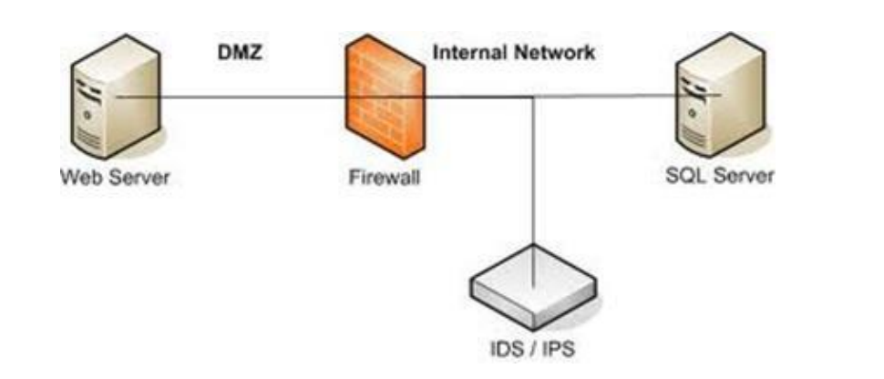

### Wzorzec działania zapor ogniowych:
- domyślne przepuszczanie, 
- domyślne odrzucanie 

### Urządzenia IDS/IPS
- IDS - Intrusion Detection System - wykrywa i raportuje  
- IPS - Inttrustion Protection System - wykrywa i reaguje 

### Listy ACL (Access Control Lists)
