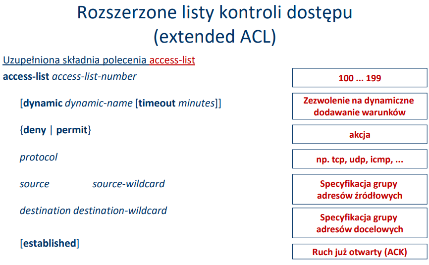
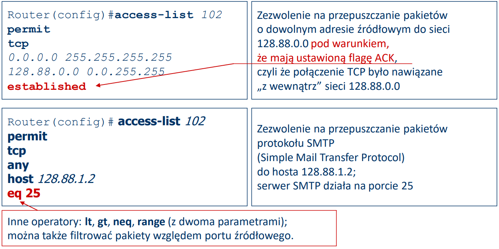

### Wzorzec działania zapor ogniowych:
- domyślne przepuszczanie, 
- domyślne odrzucanie 

### Urządzenia IDS/IPS
- IDS - Intrusion Detection System - wykrywa i raportuje  
- IPS - Inttrustion Protection System - wykrywa i reaguje 

## Listy ACL (Access Control Lists)
Najprostsze klasyfikatory (**standard**) klasyfikują jedynie na podstawie adresu źródłowego. Są także rozszerzone (**extended**), które klasyfikują na podstawie: 
- adresów źródłowych i docelowych 
- informacji dodatkowej: numerów portów TCP, UDP, pakietach ICMP, flag TCP itd.

Pakiety przechodzą sekwencyjnie przez listę dostępu - dlatego na początku listy są wpisy najbardziej szczegółowe. 

Tworzenie firewalla przebiega dwuetapowo:   
1. Definiowanie listy o konkretnym numerze (określającym jej rodzaj):    
```cisco
access-list NUMER permit|deny ADRES_ŹRÓDŁOWY WILDCARD
```
2. Przypisanie list konkretnym interfejsom:  
```cisco
ip access-group NUMER in|out
```

Aby wyświetlić utworzone listy wywołaj: `show access-lists`

## Działanie odwróconych masek (wildcard)
Działają analogicznie do zwykłych  masek adresu, lecz wykonują operację *OR* (zamiast operacji *AND*). W efekcie:
- 0 - sprawdź odpowiedni bit 
- 1 - bit nieistotny 

**Przykład**:
W liście dostępu mamy wpis: `10.131.10.40 0.0.255.0 deny`. Przychodzi pakiet z adresem źródłowym `10.131.51.40`. Przykładając maskę do adresu w liście dostajemy: `10.131.255.40`, robiąc to samo dla kolejnego adresu: `10.131.255.40`. Dostaliśmy to samo, czyli adres dopasował się do wpisu w liście - zostanie odrzucony.  

## Rozszerzone listy dostępu



**Typy list dostępu rozróżniane są przez ich numer. Przykładowo:**
- 1-99 standard IP
- 100-199 extended IP 
