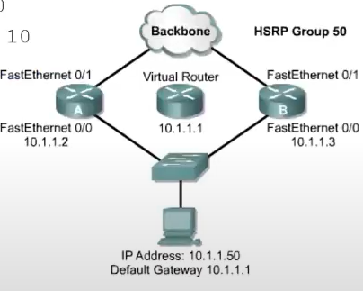

```cisco
R(config-if) #standby 50 ip 10.1.1.1 // udawaj router o danym ip
R(config-if) #standby 50 priority 95 
R(config-if) #standby 50 preempt // możliwość wywłaszczenia 
R(config-if) #standby 50 timers 3 10 // co 3 sek., ważność 10 sek.
R(config-if) #standby 50 track f0/1 10 

R#show standby [brief]
R#debug standby 
```
Należy wyłączyć ICMP Redirect 

