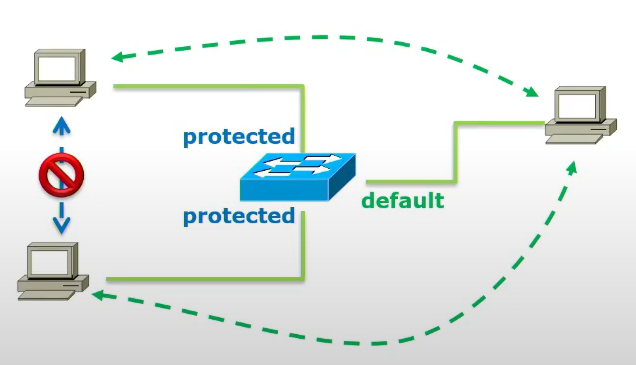
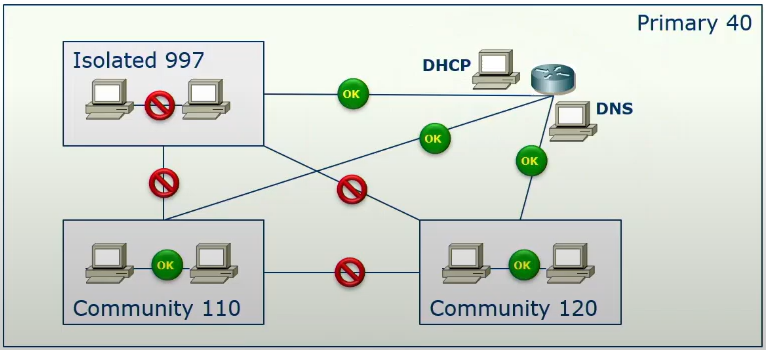
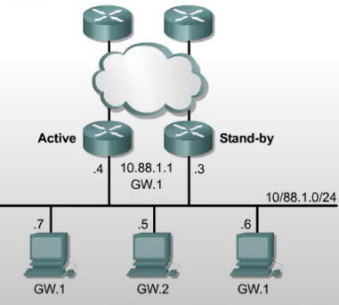

# Prywatne VLANy
Sieci tego samego typu należy budować na switchach należących do tej samej 'klasy zaufania'
- sieci zaufane łączymy na 'zaufanym' switchu 
- sieci strefy DMZ łączymy na switchu DMZ,
- sieci niezaufane na 'niezaufanym' switchu 

### Ewolucja rozwiązań:
- protected port (private VLAN edge) - port nalezy do VLAN, ale nie może komunikować się z innym zabezpieczonym portem brzegowym 

- private VLAN - wewnątrz podstawowej sieci VLAN (primary) definiujemy pod-VLANy: isolated (jeden), community (może być wiele). Porty promiscuous - jawne, dostępne porty (każdy może się z nimi komunikować)

W prywatnych VLANach wszystkie hosty należą do tej samej podsieci IP.

- Primary VLAN – główny VLAN
- Isolated VLAN – porty, które nie mogą się komunikować z nikim, tylko z promiscuous portem
- Community VLAN – porty mogą rozmawiać między sobą i z promiscuous portem

Promiscuous port – może rozmawiać ze wszystkimi (np. router, firewall)
# Hot Standby Routing Protocol (HSRP)
Ustawiamy hostów nieistniejącą bramę - routery podszywają się pod niego (podobne do ProxyARP, ale maski podsieci są takie same). 

Jest to tzw. wirtualny router z wirtualnym adresem MAC. W przypadku awarii jednego routera, drugi router przejmuje tą wirtualną adresację. Musi także powiadomić switche, aby te zaaktualizowały swoje tablice FDB (gratuitous ARP). 